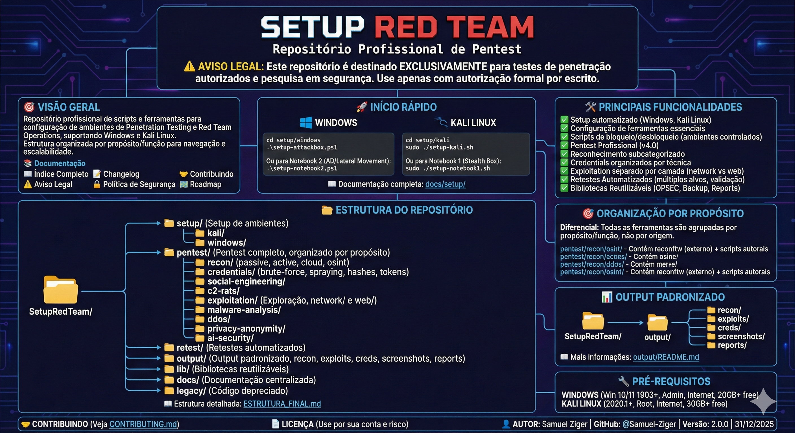

# Setup Red Team - Repositório Profissional de Pentest




> ⚠️ **AVISO LEGAL:** Este repositório é destinado EXCLUSIVAMENTE para testes de penetração autorizados e pesquisa em segurança. Use apenas com autorização formal por escrito.

---

## 🎯 Visão Geral

Repositório profissional de scripts e ferramentas para configuração de ambientes de **Penetration Testing** e **Red Team Operations**, suportando Windows e Kali Linux.

**Estrutura organizada por propósito/função** - Todas as ferramentas agrupadas logicamente para facilitar navegação e escalabilidade.

---

## 📚 Documentação

- 📖 **[Índice Completo](./INDEX.md)** - Navegação rápida por todo o repositório
- 📝 **[Changelog](./CHANGELOG.md)** - Histórico de atualizações
- ⚠️ **[Aviso Legal](./DISCLAIMER.md)** - Leia antes de usar
- 🔒 **[Política de Segurança](./SECURITY.md)** - Reporte de vulnerabilidades
- 🤝 **[Contribuindo](./CONTRIBUTING.md)** - Guia para contribuidores
- 🗺️ **[Roadmap](./ROADMAP.md)** - Direções futuras do projeto

---

## 🚀 Início Rápido

### Windows

```powershell
cd setup/windows
.\setup-attackbox.ps1
```

**Ou para Notebook 2 (AD/Lateral Movement):**
```powershell
.\setup-notebook2.ps1
```

📖 **Documentação completa:** [docs/setup/](./docs/setup/)

### Kali Linux

```bash
cd setup/kali
sudo ./setup-kali.sh
```

**Ou para Notebook 1 (Stealth Box):**
```bash
sudo ./setup-notebook1.sh
```

---

## 📁 Estrutura do Repositório

```
SetupRedTeam/
├── setup/              # Setup de ambientes
│   ├── kali/           # Scripts Kali Linux
│   └── windows/        # Scripts Windows
│
├── pentest/            # Pentest completo (organizado por propósito)
│   ├── recon/          # Reconhecimento (passive, active, cloud, osint)
│   ├── credentials/    # Credentials (brute-force, spraying, hashes, tokens)
│   ├── social-engineering/
│   ├── c2-rats/
│   ├── exploitation/   # Exploração (network/ e web/)
│   │   ├── network/    # Camada de rede (ssh, telnet, smtp, dns, wifi)
│   │   └── web/        # Camada de aplicação (sql, mysql, joomla, generic)
│   ├── malware-analysis/
│   ├── ddos/
│   ├── privacy-anonymity/
│   └── ai-security/
│
├── retest/             # Retestes automatizados
├── output/             # Output padronizado (recon, exploits, creds, screenshots, reports)
├── lib/                # Bibliotecas reutilizáveis
├── docs/               # Documentação centralizada
└── legacy/             # Código depreciado
```

📖 **Estrutura detalhada:** [ESTRUTURA_FINAL.md](./ESTRUTURA_FINAL.md)

---

## 🛠️ Principais Funcionalidades

### Setup de Ambientes
- ✅ Setup automatizado para Windows e Kali Linux
- ✅ Configuração de ferramentas essenciais
- ✅ Scripts de bloqueio/desbloqueio (ambientes controlados)

### Pentest Profissional
- ✅ Scripts de pentest completo (v4.0)
- ✅ Reconhecimento subcategorizado (passive, active, cloud, osint)
- ✅ Credentials organizados por técnica
- ✅ Exploitation separado por camada (network vs web)
- ✅ Social engineering, C2/RATs, malware analysis

### Retestes Automatizados
- ✅ Scripts de reteste para múltiplos alvos
- ✅ Validação de correções de vulnerabilidades
- ✅ Relatórios automatizados

### Bibliotecas Reutilizáveis
- ✅ OPSEC (segurança operacional)
- ✅ Backup automatizado
- ✅ Geração de relatórios
- ✅ Verificação de recursos

---

## ⚠️ Avisos Importantes

- ❌ **NÃO use sem autorização expressa**
- ✅ **Use apenas em ambientes controlados**
- 🔒 **Respeite leis locais e internacionais**
- 📋 **Leia [DISCLAIMER.md](./DISCLAIMER.md) antes de usar**

---

## 📖 Documentação por Categoria

### Setup
- [Setup Kali Linux](./docs/setup/executar-setup-kali.md)
- [Setup Windows](./docs/setup/) (em desenvolvimento)

### Pentest
- [Guia Completo de Pentest](./docs/pentest/guia-completo.md)
- [Quick Start](./docs/pentest/quick-start.md)
- [Checklist Pentest](./pentest/CHECKLIST_PENTEST.md)

### Retest
- [Retestes Automatizados](./retest/README_PENTEST.md)
- [Múltiplos Alvos](./retest/README_TODOS_ALVOS.md)

### OPSEC
- [Checklist OPSEC](./docs/opsec/opsec-checklist.md)

### Guias
- [Estratégia de Backup](./docs/guides/backup-strategy.md)
- [Guia de Upgrade](./docs/guides/upgrade-guide.md)
- [Notebook 2 Completo](./docs/guides/notebook2-completo.md)

---

## 🎯 Organização por Propósito

**Diferencial:** Todas as ferramentas são agrupadas por **propósito/função**, não por origem.

**Exemplos:**
- `pentest/recon/osint/` - Contém reconftw (externo) + scripts autorais
- `pentest/social-engineering/` - Contém zphisher (externo) + rubber-ducky (autoral)
- `pentest/exploitation/web/generic/` - Contém buster, injector (externos) + scripts autorais

**Benefícios:**
- ✅ Facilita encontrar ferramentas por função
- ✅ Escala melhor quando o repositório cresce
- ✅ Navegação intuitiva para novos usuários
- ✅ Facilita automação

---

## 📊 Output Padronizado

Todos os resultados são salvos em `output/` de forma padronizada:

```
output/
├── recon/          # Resultados de reconhecimento
├── exploits/       # Resultados de exploração
├── creds/          # Credenciais encontradas
├── screenshots/    # Screenshots/evidências
└── reports/        # Relatórios finais
```

📖 **Mais informações:** [output/README.md](./output/README.md)

---

## 🔧 Pré-requisitos

### Windows
- Windows 10/11 (versão 1903+)
- Permissões de Administrador
- Conexão com internet
- 20GB+ de espaço livre

### Kali Linux
- Kali Linux 2020.1+
- Acesso root
- Conexão com internet
- 30GB+ de espaço livre

---

## 🤝 Contribuindo

Contribuições são bem-vindas! Veja [CONTRIBUTING.md](./CONTRIBUTING.md) para diretrizes.

---

## 📄 Licença

Este projeto é fornecido "como está", sem garantias. Use por sua conta e risco.

**O autor não se responsabiliza por uso indevido destes scripts.**

---

## 🔗 Links Úteis

- [Índice Completo](./INDEX.md)
- [Changelog](./CHANGELOG.md)
- [Roadmap](./ROADMAP.md)
- [Estrutura Final](./ESTRUTURA_FINAL.md)

---

## 👤 Autor

**Samuel Ziger**
- GitHub: [@Samuel-Ziger](https://github.com/Samuel-Ziger)

---

**Última atualização:** 31 de Dezembro de 2025  
**Versão:** 2.0.0 (Reorganização Profissional)
